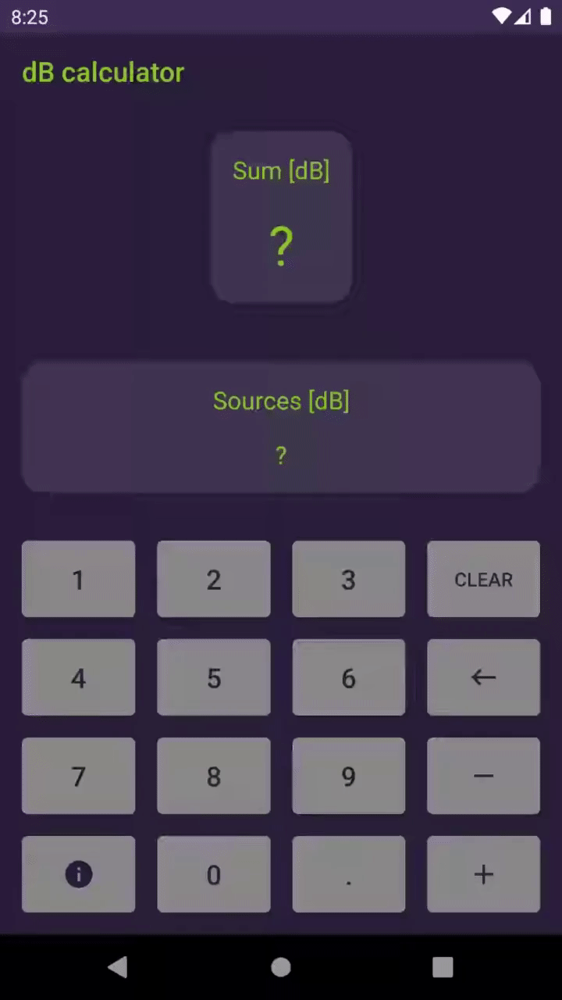

# dBCalculator
It allows you to do logarithmic sums in dB.

Very useful for adding noise sources fast and anywhere.

Install it on [Google Play](https://play.google.com/store/apps/details?id=com.appacoustic.android.dbcalculator).

More info on [AppAcoustiC](http://appacoustic.com/).

### Collaborate

I am [Gabi Moreno](https://gabimoreno.soy).

This is an open source project. **Feel free to request issues**.

And for sure, **Pull Requests are opened** and super-well received.

Thank you very much! 🤗
